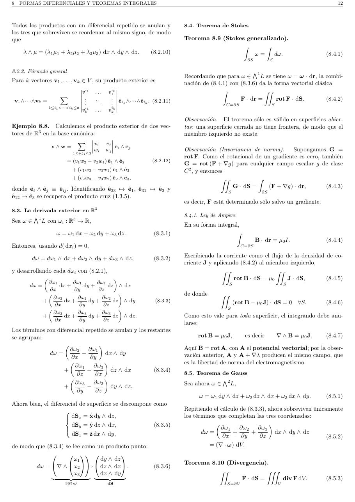
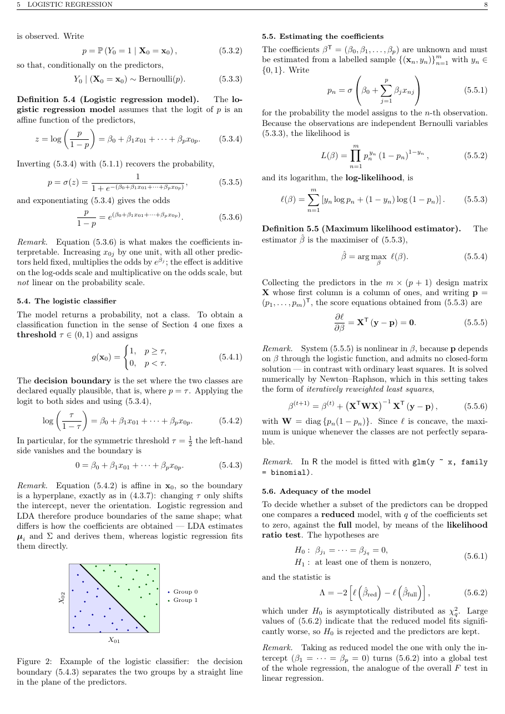
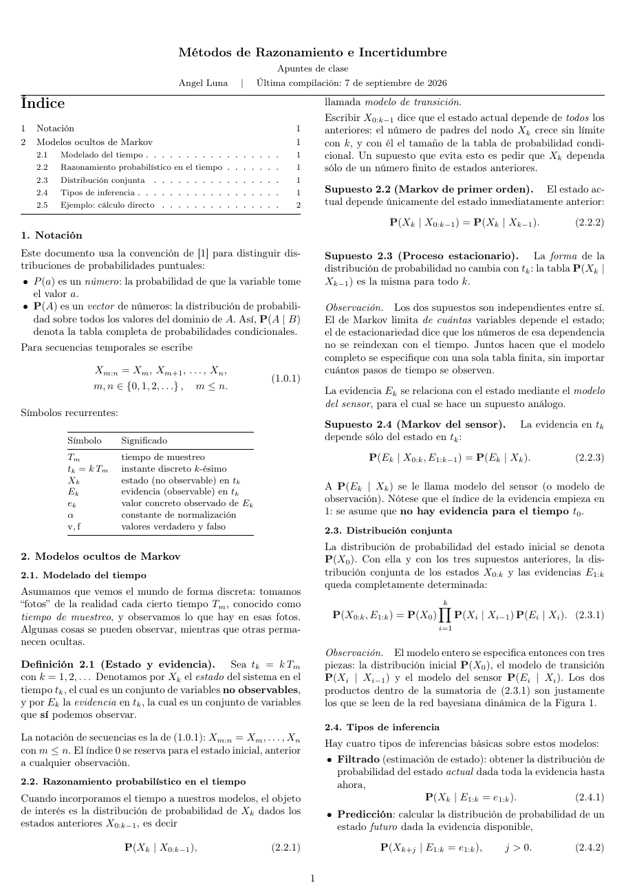

<div align="center">

# LaTeX Notes

**Typeset lecture notes and self-study material in mathematics, physics and statistics.**

Dense two-column layout · hand-rolled theorem environments · TikZ figures · English & Spanish


</div>

---

## Documents

Every directory is a self-contained document with its own preamble; the compiled PDF is committed next to the source so it can be read directly on GitHub.

| Document | PDF | Language | Pages | Topics |
|---|---|:---:|:---:|---|
| **Métodos Matemáticos para la Física** | [`AMMF.pdf`](mathematical_methods/AMMF.pdf) | ES | 20 | Vector spaces, vector calculus, curvilinear coordinates, curve & surface theory, differential forms and the integral theorems, complex analysis, power series, Fourier series, contour integration |
| **Multivariate Methods** | [`multivariate_methods.pdf`](multivariate_methods/multivariate_methods.pdf) | EN / ES | 9 | Principal components, factor analysis, discriminant analysis, logistic regression |
| **Métodos de Razonamiento e Incertidumbre** | [`razonamiento_incertidumbre.pdf`](razonamiento_incertidumbre/razonamiento_incertidumbre.pdf) | ES | 2 | Temporal probabilistic models, hidden Markov models, filtering / prediction / smoothing |
| **Mathematics** *(self-study, in progress)* | [`self_study.pdf`](math_self_study/self_study.pdf) | EN | 2 | Real numbers, norms and inner products, coordinate systems; manifolds and number theory sections stubbed |

## Preview

<table>
  <tr>
    <td align="center" width="33%">
      <a href="mathematical_methods/AMMF.pdf"></a><br>
      <sub><b>Métodos Matemáticos</b> — exterior derivative, Stokes and Gauss</sub>
    </td>
    <td align="center" width="33%">
      <a href="multivariate_methods/multivariate_methods.pdf"></a><br>
      <sub><b>Multivariate Methods</b> — logistic classifier and maximum likelihood</sub>
    </td>
    <td align="center" width="33%">
      <a href="razonamiento_incertidumbre/razonamiento_incertidumbre.pdf"></a><br>
      <sub><b>Razonamiento e Incertidumbre</b> — hidden Markov models</sub>
    </td>
  </tr>
</table>

## What's inside

### Métodos Matemáticos para la Física — 12 sections

Course notes for a mathematical-methods sequence, written in Spanish. The first block builds vector calculus up to differential forms; the second covers complex analysis through to Laurent series.

- **Linear algebra** — inner products, norms, Gram–Schmidt, the wedge product in $\mathbb{R}^3$ and its physical interpretation
- **Vector calculus** — differentiability, gradient and tangent plane, implicit and inverse function theorems
- **Coordinates and geometry** — polar, cylindrical and spherical systems; Frénet–Serret frame, torsion; parametrised surfaces and area/volume elements
- **Differential forms** — exterior algebra, exterior derivative, Stokes and Gauss theorems, Ampère's law as a worked application
- **Complex analysis** — Cauchy–Riemann equations, harmonic functions, stereographic projection, contour deformation, Cauchy's integral formula, Liouville, Laurent series and poles
- **Series** — uniform convergence, radius of convergence, Taylor's theorem, Fourier series in complex and real form

### Multivariate Methods — 5 sections

Bilingual by design: derivations in English, procedural summaries (*resumen del proceso*, *planteamiento*) in Spanish.

- **Principal components** — the maximisation lemma, uncorrelatedness of the components, total population variance, loadings, components from standardised variables
- **Factor analysis** — the orthogonal factor model, implied covariance structure, factor-score estimation
- **Discriminant analysis** — Gaussian discriminant model, Bayes classifier, canonical variables and Fisher's criterion, estimation from labelled data, assumption checking and variable selection
- **Logistic regression** — logit transformation, maximum-likelihood fitting via iteratively reweighted least squares, likelihood-ratio tests; decision boundary figures in TikZ

### Métodos de Razonamiento e Incertidumbre — 2 sections

- **Hidden Markov models** — Markov and stationarity assumptions, joint distribution of a temporal model, the four inference tasks (filtering, prediction, smoothing, most-likely explanation), filtering by enumeration on the umbrella example, with a dynamic Bayesian network drawn in TikZ

## Typesetting approach

The notes share one deliberately minimal house style rather than a stock theorem package:

- **Dense two-column `article`** on A4 with tight `geometry`, compact `titlesec` headings and `enumitem` lists, so a lecture fits in a couple of pages instead of ten.
- **Theorem environments are hand-rolled** with `\newenvironment` over a single counter reset per section — no `amsthm` styles, no coloured boxes. Every environment takes an optional name: `\begin{theorem}[Spectral decomposition]`.
- **Equations numbered within subsection** (`5.5.3`), with every numbered equation labelled so cross-references stay stable as sections grow.
- **Spanish documents** carry Spanish environment names (`teorema`, `demostracion`, `observacion`, …) and load `babel` with `es-noshorthands`, `es-nodecimaldot`, `es-nolists` so that Spanish typography never leaks into math mode.
- **Figures are native TikZ** — no imported images — so they scale with the text and match its fonts.
- **Per-document macro sets** for the notation of each subject: bold-Greek parameters and `\E`, `\Var`, `\Cov` for statistics; `\Ext{n}`, `\rot`, `\braket` for physics; `\Prob`, `\given`, state/evidence shorthands for probabilistic reasoning.

## Building

Requires TeX Live (tested with 2025). Compile from *inside* a document's directory, since every main file uses relative `\input{sections/...}` paths:

```bash
cd mathematical_methods
latexmk -pdf AMMF.tex
```

`latexmk` runs the extra passes needed for the table of contents and cross-references. The other entry points are `multivariate_methods/multivariate_methods.tex`, `razonamiento_incertidumbre/razonamiento_incertidumbre.tex` and `math_self_study/self_study.tex`.

## Layout

```
LaTeX_Notes/
├── mathematical_methods/        AMMF.tex + sections/ (12 files)
├── multivariate_methods/        multivariate_methods.tex + sections/ (5 files)
├── razonamiento_incertidumbre/  razonamiento_incertidumbre.tex + sections/ (2 files)
├── math_self_study/             self_study.tex + sections/ (3 files)
└── assets/                      page previews used in this README
```

## Author

**Angel Luna** — lecture notes written for my own courses and self-study; shared in case they are useful to someone else studying the same material.
